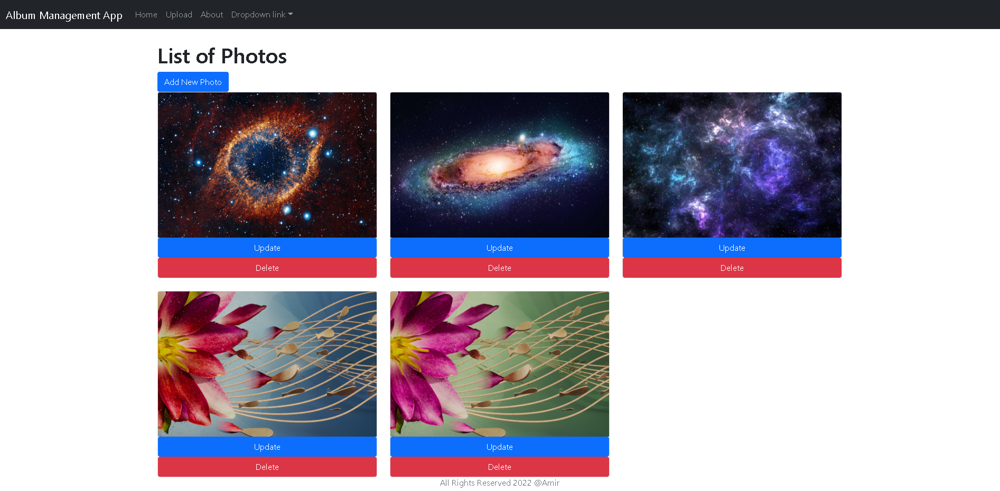

# Photo Album 

##  You can download, upload, delete or change images. Photo album using React and .Net 6 Rest API.  

## React Package
* "@testing-library/jest-dom": "^5.16.4",
* "@testing-library/react": "^13.3.0",
* "@testing-library/user-event": "^13.5.0",
* "axios": "^0.27.2",
* "bootstrap": "^5.1.3",
* "http-proxy-middleware": "^2.0.6",
* "jest-editor-support": "^30.1.0",
* "react": "^18.2.0",
* "react-dom": "^18.2.0",
* "react-router-dom": "^6.3.0",
* "react-scripts": "5.0.1",
* "spotlight.js": "^0.7.8",
* "web-vitals": "^2.1.4"

## .Net Package
* Microsoft.EntityFrameworkCore 6.0.6
* Microsoft.EntityFrameworkCore.SqlServer 6.0.6
* Microsoft.EntityFrameworkCore.Tools 6.0.6
* Microsoft.VisualStudio.Web.CodeGeneration.Design 6.0.6
